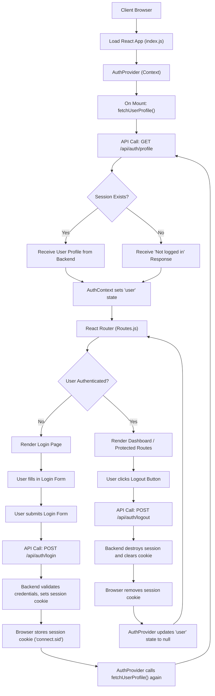

### Frontend Flowchart

```mermaid
flowchart TD
  %% Application Initialization and Session Check
  A["Client Browser"]
  A --> B["Load React App (index.js)"]
  B --> C["AuthProvider (Context)"]
  C --> D["On Mount: fetchUserProfile()"]
  D --> E["API Call: GET /api/auth/profile"]
  E --> F{"Session Exists?"}
  F -- "Yes" --> G["Receive User Profile from Backend"]
  F -- "No" --> H["Receive 'Not logged in' Response"]
  G --> I["AuthContext sets 'user' state"]
  H --> I
  I --> J["React Router (Routes.js)"]
  J --> K{"User Authenticated?"}
  K -- "Yes" --> L["Render Dashboard / Protected Routes"]
  K -- "No" --> M["Render Login Page"]

  %% Login Flow
  M --> N["User fills in Login Form"]
  N --> O["User submits Login Form"]
  O --> P["API Call: POST /api/auth/login"]
  P --> Q["Backend validates credentials, sets session cookie"]
  Q --> R["Browser stores session cookie ('connect.sid')"]
  R --> S["AuthProvider calls fetchUserProfile() again"]
  S --> E

  %% Logout Flow
  L --> T["User clicks Logout Button"]
  T --> U["API Call: POST /api/auth/logout"]
  U --> V["Backend destroys session and clears cookie"]
  V --> W["Browser removes session cookie"]
  W --> X["AuthProvider updates 'user' state to null"]
  X --> J
```
